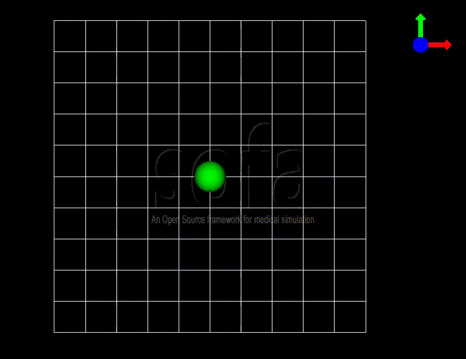
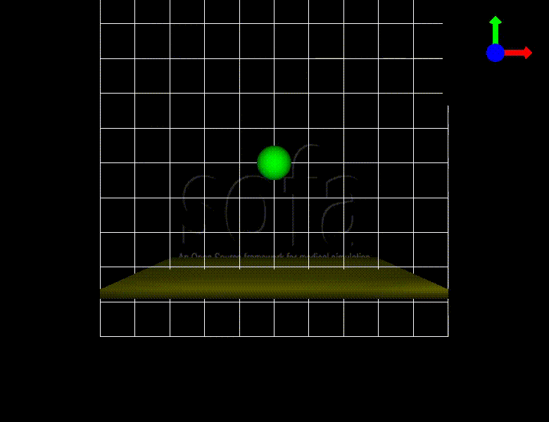
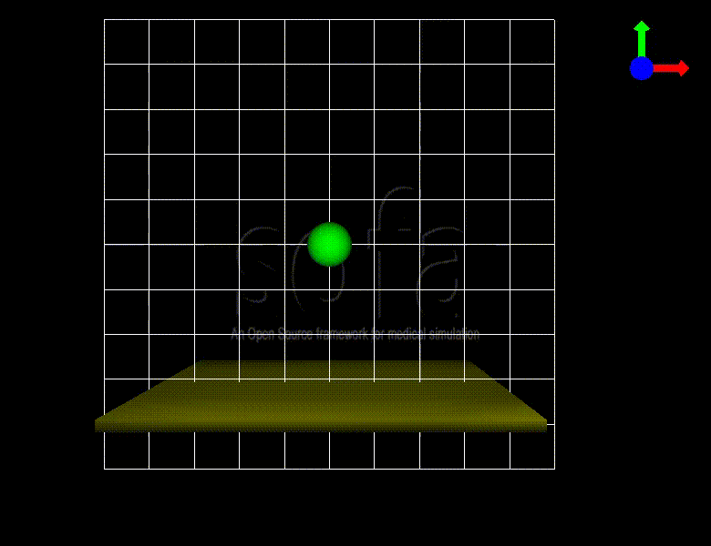

Using the plugin
================

The SofaPython3 plugins allows you to embed a python3 interpreter into an exising SOFA application (eg: runSofa) and to create/launch SOFA simulations from a python environment.

Prerequisites
-------------

If you downloaded and installed SOFA and its headers from the `SOFA website <https://www.sofa-framework.org/download/>`_, make sure to have python3.7 installed on your computed.

.. content-tabs::

	.. tab-container:: tab1
		:title: Ubuntu

			Run in a terminal:

			.. code-block:: bash

				sudo add-apt-repository ppa:deadsnakes/ppa
				sudo apt install libpython3.7 python3.7 python3-pip
				python3.7 -m pip install numpy

			if you want to launch the runSofa:

			.. code-block:: bash

				sudo apt install libopengl0

	.. tab-container:: tab2
		:title: MacOS

			Run in a terminal:

			.. code-block:: bash

				brew install python@3.7
				export PATH="/usr/local/opt/python@3.7/bin/:$PATH"

			BigSur only:

			.. code-block:: bash

				pip3 install --upgrade pip
				python3.7 -m pip install numpy

			Catalina only:

			.. code-block:: bash

				pip3 install numpy

	.. tab-container:: tab3
		:title: Windows

		Download and install `Python 3.7 64bit <https://www.python.org/ftp/python/3.7.9/python-3.7.9-amd64.exe>`_

Within runSofa
--------------

Using SofaPython3 in runSofa requires loading the SofaPython3 plugin in your runSofa environment.

    
    

* If you downloaded and installed SOFA and its headers from the `SOFA website <https://www.sofa-framework.org/download/>`_, or if you `compiled SofaPython3 in-tree <https://sofapython3.readthedocs.io/en/latest/menu/Compilation.html#in-tree-build>`_, you can load the SofaPython3 plugin using the PluginManager (in the GUI) or by auto-loading the plugin in runSofa: simply copy the file **plugin_list.conf.default** in *<SOFA_build>/lib*, and rename it **plugin_list.conf**, then add the line:

	.. code-block:: bash

		SofaPython3 NO_VERSION

	..
		Note that adding the line to the file **plugin_list.conf.default** in *<SOFA_build>/lib* would work, but you would need to add the line everytime you compile the code.

	Having the SofaPython3 plugin active will allow you to open scene files using the ".py, .py3, .pyscn, .pyscn3" file extension in runSofa, with the command :

	.. code-block:: bash

		<SOFA_build>/bin/runSofa <your_python_file>

* If you `compiled SofaPython3 out-of-tree <https://sofapython3.readthedocs.io/en/latest/menu/Compilation.html#out-of-tree-build>`_, you can load the SofaPython3 following one of this step:

  * use the "-l" of runSofa: ``runSofa -l /path/to/SofaPython3_build/lib/libSofaPython3.so <scene>``
  * or use the environment variable ``SOFA_PLUGIN_PATH=/path/to/SofaPython3_build/``
  * or add the component ``<AddPluginRepository path="/path/to/SofaPython3_build/"/>`` in your scene
  * or start runSofa, manually load the SofaPython3 library using *Edit->Plugin Manager->Add* , then restart runSofa: the plugin should load automatically

Within a python3 interpreter
----------------------------

Before running your simulations, you must make sure to define the following environment variables:

.. content-tabs::

	.. tab-container:: tab1
		:title: Ubuntu

			Run in a terminal:

			.. code-block:: bash

				export SOFA_ROOT=/path/to/SOFA_install
				export PYTHONPATH=/path/to/SofaPython3/lib/python3/site-packages:$PYTHONPATH

	.. tab-container:: tab2
		:title: MacOS

			Run in a terminal:

			.. code-block:: bash

				export SOFA_ROOT=/path/to/SOFA_install
				export PYTHONPATH=/path/to/SofaPython3/lib/python3/site-packages:$PYTHONPATH
				export PATH="/usr/local/opt/python@3.7/bin/:$PATH"

	.. tab-container:: tab3
		:title: Windows

		    * Create a system variable **SOFA_ROOT** and set it to ``<SOFA-install-directory>``
		    * Create a system variable **PYTHON_ROOT** and set it to ``<Python3-install-directory>``
		    * Create a system variable **PYTHONPATH** and set it to ``%SOFA_ROOT%\plugins\SofaPython3\lib\python3\site-packages``
		    * Edit the system variable **Path** and add at the end ``;%PYTHON_ROOT%;%PYTHON_ROOT%\DLLs;%PYTHON_ROOT%\Lib;%SOFA_ROOT%\bin;``
		    * Open a Console (cmd.exe) and run ``python -V && python -m pip install numpy scipy``

		After that, all you need to do is open a Console (cmd.exe) and run: ``runSofa -lSofaPython3``

It is possible to use SOFA in any python3 interpreter.
The following code should cover most basic SOFA elements:

.. code-block:: python

        # to be able to create SOFA objects you need to first load the plugins that implement them.
        # For simplicity you can load the plugin "SofaComponentAll" that will load all most
        # common sofa objects.
        import SofaRuntime
        SofaRuntime.importPlugin("SofaComponentAll")

        # to create elements like Node or objects
	import Sofa.Core

Simple example
--------------

A scene in SOFA is an ordered tree of nodes representing objects (example of node: hand), with parent/child relationship (example of hand's child: finger). Each node has one or more components. Every node and component has a name and a few features. The main node at the top of the tree is usually called "rootNode" or "root".

Just like with the legacy SofaPython plugin, SofaPython3 searches for a `createScene(arg0: Sofa.Core.Node) -> Sofa.Core.Node` method in the python script, to use as the entry point of the SOFA simulation, and taking a single parameter: the root Node.  Thus define this method:

.. code-block:: python
		
	def createScene(rootNode):
		#Doesn't do anything yet
		return rootNode

You can then load a python scene in SOFA, but it doesn't do much. Let's enrich this scene!

Create your first element
^^^^^^^^^^^^^^^^^^^^^^^^^
First things first, we import the module Sofa.Core, to have access to the functions we will need.
Then, we add a grid, in order to see things more clearly. To do that, we simply need to add an object to the rootNode with the right properties :

.. code-block:: python 

	import Sofa.Core

	def createScene(rootNode):
		rootNode.addObject("OglGrid", nbSubdiv=10, size=1000)

Now, we create a new child node, in order to add the general configuration of the scene : required plugins (here SofaPython3) and other tools (like a system of axes).

.. code-block:: python

	confignode = rootNode.addChild("Config")
	confignode.addObject('RequiredPlugin', name="SofaPython3", printLog=False)
	confignode.addObject('OglSceneFrame', style="Arrows", alignment="TopRight")

Finally, we add the sphere itself, which consists of two parts : the mechanical representation and the visual representation of the sphere: 

.. code-block:: python

    #Creating the sphere
    sphere = rootNode.addChild("sphere")
    sphere.addObject('MechanicalObject', name="mstate", template="Rigid3", translation2=[0., 0., 0.], rotation2=[0., 0., 0.], showObjectScale=50)

    #### visualization
    sphereVisu = sphere.addChild("VisualModel")
    sphereVisu.loader = sphereVisu.addObject('MeshObjLoader', name="loader", filename="mesh/ball.obj")
    sphereVisu.addObject('OglModel', name="model", src="@loader", scale3d=[50]*3, color=[0., 1., 0.], updateNormals=False)
    sphereVisu.addObject('RigidMapping')

.. image:: ../images/exampleScene_step1.png
	:alt: This is what you should see in Sofa at this stage
	:align: center
	:height: 250pt

Now, if you execute your scene, you can see a sphere, but it won't move if you click on the Animate button in SOFA. Let's change that!

Add movements and forces
^^^^^^^^^^^^^^^^^^^^^^^^

A default gravity force is implemented on SOFA. Here we reset it, for learning purposes. We also define the time step of the simulation.

.. code-block:: python
	
	rootNode.findData('gravity').value=[0.0,-9.81,0.0];
	rootNode.findData('dt').value=0.01

We add a mechanical model, so that all our futur elements will have the same total mass, volume and inertia matrix :

.. code-block:: python

	totalMass = 1.0
	volume = 1.0
	inertiaMatrix=[1., 0., 0., 0., 1., 0., 0., 0., 1.]

We add properties to the sphere. First, we add a mass, then an object called 'UncoupledConstraintCorrection', in charge of computing the constraint forces of the sphere, then we add two different solvers. One is a time integration scheme that defines the system to be solved at each time step of the simulation (here the implicit Euler Method), the other is a solving method (here the Conjugate Gradient method), that solves the equations governing the model at each time step, and updates the MechanicalObject.

.. code-block:: python

	sphere.addObject('UniformMass', name="mass", vertexMass=[totalMass, volume, inertiaMatrix[:]])
	sphere.addObject('UncoupledConstraintCorrection')

	sphere.addObject('EulerImplicitSolver', name='odesolver')
	sphere.addObject('CGLinearSolver', name='Solver')

Now, if you click on the Animate button in SOFA, the sphere will fall.

Add a second element 
^^^^^^^^^^^^^^^^^^^^

Let's add a second element, a floor, to see how they interact :

.. code-block:: python

    floor = rootNode.addChild("floor")
    floor.addObject('MechanicalObject', name="mstate", template="Rigid3", translation2=[0.0,-300.0,0.0], rotation2=[0., 0., 0.], showObjectScale=5.0)
    floor.addObject('UniformMass', name="mass", vertexMass=[totalMass, volume, inertiaMatrix[:]])

    floorVisu = floor.addChild("VisualModel")
    floorVisu.loader = floorVisu.addObject('MeshObjLoader', name="loader", filename="mesh/floor.obj")
    floorVisu.addObject('OglModel', name="model", src="@loader", scale3d=[5.0]*3, color=[1., 1., 0.], updateNormals=False)
    floorVisu.addObject('RigidMapping')
        

A floor has now been added to the scene. It is a stationnary object, it won't move during the simulation. When you click on the Animate button, you can see that the sphere goes through the floor, as if there were nothing there. That is because there is no collision modeling in the scene yet.

Add a collision model
^^^^^^^^^^^^^^^^^^^^^

We first add a collision model for the scene in general, that is stating how a contact between the objects is handled: here the objects must not be able to go through one another. Potential collisions are looked for within an alarmDistance radius from the objet. If a collision situation is detected, the collision model computes the behaviour of the objects, which are stopped at a ContactDistance from each other.

.. code-block:: python

	rootNode.addObject('DefaultPipeline')
	rootNode.addObject('FreeMotionAnimationLoop')
	rootNode.addObject('GenericConstraintSolver', tolerance="1e-6", maxIterations="1000")
	rootNode.addObject('BruteForceDetection')
	rootNode.addObject('RuleBasedContactManager', responseParams="mu="+str(0.0), name='Response', response='FrictionContact')
	rootNode.addObject('LocalMinDistance', alarmDistance=10, contactDistance=5, angleCone=0.01)

We add a new child node to the sphere, that will be in charge of processing the collision.

.. code-block:: python

	collision = sphere.addChild('collision')
	collision.addObject('MeshObjLoader', name="loader", filename="mesh/ball.obj", triangulate="true", scale=45.0)

	collision.addObject('MeshTopology', src="@loader")
	collision.addObject('MechanicalObject')

	collision.addObject('TriangleCollisionModel')
	collision.addObject('LineCollisionModel')
	collision.addObject('PointCollisionModel')

	collision.addObject('RigidMapping')

We do the same for the floor, but we also specify that the floor is a stationnary object that shouldn't move.

.. code-block:: python

	floorCollis = floor.addChild('collision')
	floorCollis.addObject('MeshObjLoader', name="loader", filename="mesh/floor.obj", triangulate="true", scale=5.0)
	floorCollis.addObject('MeshTopology', src="@loader")
	floorCollis.addObject('MechanicalObject')
	floorCollis.addObject('TriangleCollisionModel', moving=False, simulated=False)
	floorCollis.addObject('LineCollisionModel', moving=False, simulated=False)
	floorCollis.addObject('PointCollisionModel', moving=False, simulated=False)

	floorCollis.addObject('RigidMapping')

Now, the sphere is stopped by the floor, as it should be.
Congratulations! You made your first SOFA scene in Python3!

For more information on how to use the SOFA modules bindings in python, visit this page: :doc:`SofaModule`

Here is the entire code of the scene :

.. code-block:: python

	import Sofa.Core

	def createScene(rootNode):
		rootNode.addObject("OglGrid", nbSubdiv=10, size=1000)

		rootNode.findData('gravity').value=[0.0,-981.0,0.0];
		rootNode.findData('dt').value=0.01

		confignode = rootNode.addChild("Config")
		confignode.addObject('RequiredPlugin', name="SofaMiscCollision", printLog=False)
		confignode.addObject('RequiredPlugin', name="SofaPython3", printLog=False)
		confignode.addObject('OglSceneFrame', style="Arrows", alignment="TopRight")

	 	#Collision function

		rootNode.addObject('DefaultPipeline')
		rootNode.addObject('FreeMotionAnimationLoop')
		rootNode.addObject('GenericConstraintSolver', tolerance="1e-6", maxIterations="1000")
		rootNode.addObject('BruteForceDetection')
		rootNode.addObject('RuleBasedContactManager', responseParams="mu="+str(0.0), name='Response', response='FrictionContact')
		rootNode.addObject('LocalMinDistance', alarmDistance=10, contactDistance=5, angleCone=0.01)

		### Mechanical model

		totalMass = 1.0
		volume = 1.0
		inertiaMatrix=[1., 0., 0., 0., 1., 0., 0., 0., 1.]

		#Creating the floor
		floor = rootNode.addChild("floor")

		floor.addObject('MechanicalObject', name="mstate", template="Rigid3", translation2=[0.0,-300.0,0.0], rotation2=[0., 0., 0.], showObjectScale=5.0)

		floor.addObject('UniformMass', name="mass", vertexMass=[totalMass, volume, inertiaMatrix[:]])
		floorCollis = floor.addChild('collision')
		floorCollis.addObject('MeshObjLoader', name="loader", filename="mesh/floor.obj", triangulate="true", scale=5.0)
		floorCollis.addObject('MeshTopology', src="@loader")
		floorCollis.addObject('MechanicalObject')
		floorCollis.addObject('TriangleCollisionModel', moving=False, simulated=False)
		floorCollis.addObject('LineCollisionModel', moving=False, simulated=False)
		floorCollis.addObject('PointCollisionModel', moving=False, simulated=False)

		floorCollis.addObject('RigidMapping')

		#### visualization
		floorVisu = floor.addChild("VisualModel")
		floorVisu.loader = floorVisu.addObject('MeshObjLoader', name="loader", filename="mesh/floor.obj")
		floorVisu.addObject('OglModel', name="model", src="@loader", scale3d=[5.0]*3, color=[1., 1., 0.], updateNormals=False)
		floorVisu.addObject('RigidMapping')

		#Creating the sphere
		sphere = rootNode.addChild("sphere")
		sphere.addObject('MechanicalObject', name="mstate", template="Rigid3", translation2=[0., 0., 0.], rotation2=[0., 0., 0.], showObjectScale=50)
		sphere.addObject('UniformMass', name="mass", vertexMass=[totalMass, volume, inertiaMatrix[:]])
		sphere.addObject('UncoupledConstraintCorrection')

		sphere.addObject('EulerImplicitSolver', name='odesolver')
		sphere.addObject('CGLinearSolver', name='Solver')

		collision = sphere.addChild('collision')
		collision.addObject('MeshObjLoader', name="loader", filename="mesh/ball.obj", triangulate="true", scale=45.0)

		collision.addObject('MeshTopology', src="@loader")
		collision.addObject('MechanicalObject')

		collision.addObject('TriangleCollisionModel')
		collision.addObject('LineCollisionModel')
		collision.addObject('PointCollisionModel')

		collision.addObject('RigidMapping')

		#### visualization
		sphereVisu = sphere.addChild("VisualModel")
		sphereVisu.loader = sphereVisu.addObject('MeshObjLoader', name="loader", filename="mesh/ball.obj")
		sphereVisu.addObject('OglModel', name="model", src="@loader", scale3d=[50]*3, color=[0., 1., 0.], updateNormals=False)
		sphereVisu.addObject('RigidMapping')

		return rootNode

For SofaPython2 users
---------------------

If you were using the previous SofaPython plugin (2.7) and that you are willing to update your scenes for SofaPython3, this section is for you. The new SofaPython3 required a lot of development efforts, however, the way of writing a scene in a python script remains very similar. This step should be rather smooth:

* Now you have the possibility to select which part of SOFA to import depending on your needs. See the existing `SOFA modules <https://sofapython3.readthedocs.io/en/latest/menu/SofaModule.html>`_. For example:
.. code-block:: python

    import Sofa.Helper
    import Sofa.Core
    import Sofa.Components
    ...

* To load SOFA plugins, you will have to import them:
.. code-block:: python

    import SofaRuntime
    SofaRuntime.importPlugin("MyAwesomeComponent")

* To be launchable from both runSofa and a python environment, make sure that your scene structure follows:

.. code-block:: python

	# Required import for python
	import Sofa.Core
	import Sofa.Simulation
	import SofaRuntime

	# Function creating the scene and describing the graph (with nodes and components) before it is initialized
	def createScene(root):
		return root

	#Main function ONLY called if this script is called from a python environment
	def main():

		# Make sure to load all SOFA libraries and plugins
		SofaRuntime.importPlugin("SofaBaseMechanics")

		# Generate the root node
		root = Sofa.Core.Node("root")

		# Call the above function to create the scene graph
		createScene(root)

		# Once defined, initialization of the scene graph
		Sofa.Simulation.init(root)

		# Run the simulation for 10 steps
		for iteration in range(10):
			Sofa.Simulation.animate(root, root.dt.value)

	# Function used only if this script is called from a python environment, triggers the main()
	if __name__ == '__main__':
	    main()

* In the ``createScene()`` function, creating an object or a node in the scene changed as follows:

  * Objects are now added using the **addObject** function (instead of createObject):
  ``createObject('Object', name='myObjectName', data=dataValue)`` becomes ``addObject('Object', name='myObjectName', data=dataValue )``

  * Nodes are now added using the **addChild** function (instead of createChild):
  ``parentNode.createChild("childNodeName")`` becomes ``parentNode.addChild("childNodeName")``
